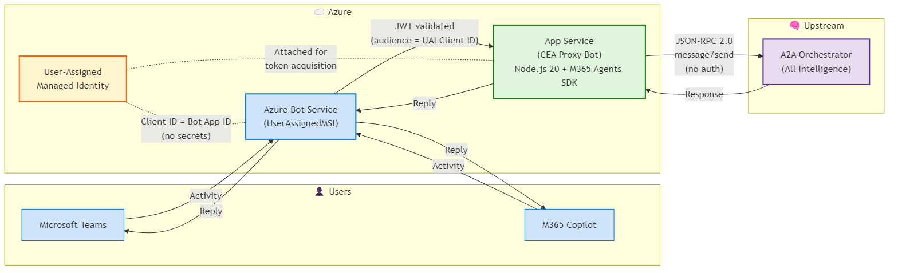
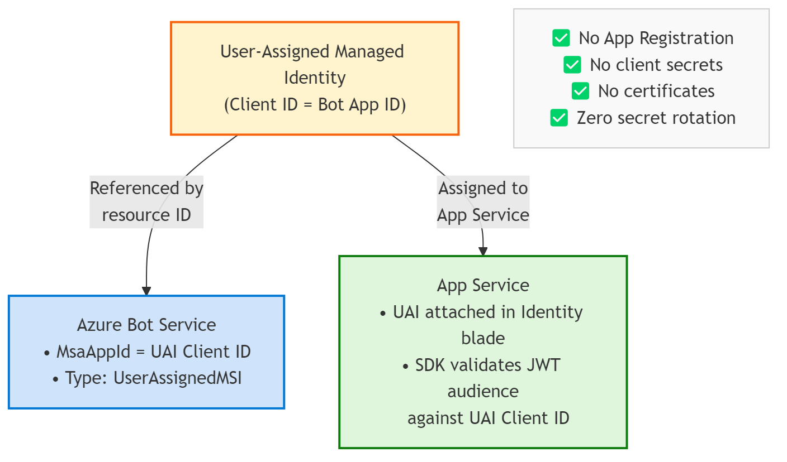

# M365 Custom Engine Agent — A2A Proxy

A lightweight TypeScript/Node.js bot that acts as a thin proxy between Microsoft Teams/M365 Copilot and an upstream Agent-to-Agent (A2A) orchestrator. Built with the M365 Agents SDK and secured using Azure User-Assigned Managed Identity for zero-secret authentication.

This bot relays conversational messages via JSON-RPC 2.0 protocol, delegating all intelligence to the upstream orchestrator while handling authentication, activity forwarding, and bot framework integration.

> **⚠️ Note:** The upstream A2A orchestrator is **not included** in this repository. This repo contains only the Custom Engine Agent proxy bot. The orchestrator used with this project is [SKCopilot-v2](https://github.com/llowevad/SKCopilot-v2) — see that repository for the A2A-compatible orchestrator endpoint.

## Architecture



### How It Works

1. **User sends a message** in Teams or M365 Copilot
2. **Azure Bot Service** validates the inbound JWT token (audience = UAI Client ID) and forwards the Activity
3. **App Service** (M365 Agents SDK) receives the Activity, extracts the text message
4. **Topic detection** determines if the message is a greeting/small talk or a real topic:
   - **Greeting detected** → Returns a welcome message with an example prompt (no A2A call)
   - **Topic detected** → Sends acknowledgment via streaming with topic summary, then proceeds to step 5
5. **Streaming progress updates** begin immediately (5-second rotation through friendly status messages)
6. **A2A Client** sends a JSON-RPC 2.0 `message/send` request to the orchestrator (no auth required)
7. **Orchestrator** processes and returns the response
8. **Final response delivered** through the same streaming connection (no separate message)
9. **Error handling** also flows through the stream if anything fails

### Managed Identity Flow



## Bot Behavior

### Streaming Progress Updates

While the A2A orchestrator is processing, the bot sends real-time progress updates every 5 seconds using the M365 Agents SDK's `StreamingResponse` class with `queueInformativeUpdate()`. These progress messages rotate through friendly status updates to keep the user informed that work is in progress:

- ⏳ Working on your request...
- 🔄 Still processing — this might take a moment...
- 🧠 The orchestrator is thinking...
- 📝 Almost there...
- ⚙️ Crunching the details...
- 🔍 Gathering information...

All progress updates and the final response appear in a single conversation bubble.

### Topic Detection & Greeting Handling

The bot uses regex matching and message length heuristics to distinguish between greetings/small talk and actual topics:

- **Greeting detected** (e.g., "hi", "hello", "hey", "thanks", "great"): Returns a welcome message with an example prompt, such as `"Write a blog post about AI in healthcare"`. No A2A call is made.
- **Topic detected**: Acknowledges immediately with `"📝 Got it — working on: {topic}"` via streaming, then sends the message to the A2A orchestrator for processing.

### Final Response Delivery

The final response from the A2A orchestrator is delivered via `queueTextChunk(response)` + `endStream()`, ensuring the response appears in the same streaming bubble as the progress updates. This provides a cohesive, single-message experience rather than fragmenting the response across multiple bubbles.

### Error Handling via Stream

If an error occurs during orchestration (timeout, authentication failure, service unavailability, or generic error), the error message is delivered through the stream using `queueTextChunk(errorMessage)` + `endStream()`. Users see context-specific error messages:

- ⏳ **Timeout**: "I'm taking longer than expected to respond. Please try again in a moment."
- 🔒 **Auth Error**: "Authentication error — please contact your administrator."
- ⚠️ **Service Unavailable**: "I'm having trouble reaching my backend service. Please try again shortly."
- ❌ **Generic Error**: "Something went wrong. Please try again. If the issue persists, contact your administrator."

## Prerequisites

- **Node.js:** 20+ (LTS recommended)
- **Azure Subscription:** With permissions to create resources
- **Azure CLI:** Installed and authenticated (`az login`)
- **PowerShell:** For infrastructure deployment and app package build scripts
- **Teams Admin:** Permissions to sideload custom Teams apps (for testing)

## Project Structure

```
M365CustomEngineAgent-BOT-MI/
├── src/
│   ├── index.ts              # Express server entry point
│   ├── agent.ts              # M365 Agents SDK bot logic
│   ├── a2aClient.ts          # JSON-RPC 2.0 client for A2A orchestrator
│   └── config.ts             # Environment variable loader
├── infra/
│   ├── deploy.ps1            # Deployment orchestration script
│   ├── main.bicep            # Root Bicep template
│   ├── main.bicepparam       # Bicep parameters file
│   └── modules/              # Modular Bicep resource templates
│       ├── uai.bicep         # User-Assigned Managed Identity
│       ├── appService.bicep  # App Service (Linux, Node 20)
│       └── botService.bicep  # Azure Bot Service (UserAssignedMSI)
├── appPackage/
│   ├── manifest.json         # Teams app manifest (v1.21)
│   ├── build-package.ps1     # Script to inject IDs and create .zip
│   ├── color.png             # App icon (192x192)
│   └── outline.png           # App icon (32x32)
├── docs/
│   ├── architecture.png      # Architecture diagram (rendered)
│   └── managed-identity.png  # Managed Identity flow diagram
├── .env.sample               # Environment variable template
├── package.json              # Node.js dependencies and scripts
├── tsconfig.json             # TypeScript configuration
└── README.md                 # This file
```

## Configuration

Copy `.env.sample` to `.env` and fill in your values:

```bash
cp .env.sample .env
```

### Environment Variables

| Variable | Description | Example |
|----------|-------------|---------|
| `BOT_APP_ID` | User-Assigned Managed Identity client ID (serves as bot App ID) | `a1b2c3d4-...` |
| `BOT_TENANT_ID` | Azure AD tenant ID | `00000000-...` |
| `MicrosoftAppId` | ⚠️ **Must match `BOT_APP_ID`** — SDK reads this for JWT validation | `a1b2c3d4-...` |
| `MicrosoftAppTenantId` | ⚠️ **Must match `BOT_TENANT_ID`** | `00000000-...` |
| `clientId` | ⚠️ **Must match `BOT_APP_ID`** — Belt-and-suspenders for SDK auth | `a1b2c3d4-...` |
| `tenantId` | ⚠️ **Must match `BOT_TENANT_ID`** | `00000000-...` |
| `A2A_BASE_URL` | Base URL of upstream A2A orchestrator (no trailing slash) | `https://orch.example.com` |
| `A2A_PATH` | Path to A2A JSON-RPC endpoint | `/a2a/orchestrator` |
| `PORT` | Local dev port (Azure App Service overrides to `8080`) | `3978` |
| `APP_SERVICE_NAME` | Azure App Service name (for app package builds) | `my-app-service` |

**Critical:** `BOT_APP_ID`, `MicrosoftAppId`, and `clientId` must all be **the same UAI client ID value**. The SDK's authentication layer reads different environment variable names depending on the code path; setting all three ensures consistent auth behavior.

## Infrastructure Deployment

Deploy all Azure resources using the provided PowerShell and Bicep templates:

```powershell
cd infra
.\deploy.ps1 -ResourceGroupName "rg-my-bot" -Location "eastus" -AppServiceName "my-bot-app"
```

**Resources created:**
- **User-Assigned Managed Identity:** Bot's authentication principal (no secrets)
- **App Service Plan:** Linux-based, B1 tier (Node.js 20 runtime)
- **App Service:** Hosts the bot application
- **Azure Bot Service:** `UserAssignedMSI` type, connected to App Service via messaging endpoint

The deployment script:
1. Creates resource group (if needed)
2. Deploys Bicep templates (`az deployment group create`)
3. Configures App Service with environment variables
4. Deploys application code (ZIP deploy)
5. Outputs bot endpoint and UAI client ID

Save the **UAI client ID** — you'll need it for `.env` and app package builds.

## Building & Running

### Install Dependencies

```bash
npm install
```

### Build TypeScript

```bash
npm run build
```

Compiles `src/**/*.ts` to `dist/**/*.js`.

### Start Production Server

```bash
npm start
```

Runs the compiled bot at `http://localhost:3978/api/messages` (or `PORT` from `.env`).

### Local Development (with hot reload)

```bash
npm run dev
```

Uses `nodemon` and `ts-node` for live reloading during development.

**Local testing with Bot Framework Emulator:**
1. Install [Bot Framework Emulator](https://github.com/Microsoft/BotFramework-Emulator/releases)
2. Configure `.env` with valid UAI credentials (or mock them for local dev)
3. Connect to `http://localhost:3978/api/messages`
4. Note: Managed Identity token acquisition may fail locally — use Azure-hosted deployments for full E2E testing

## Teams App Package

The Teams app manifest (`appPackage/manifest.json`) defines the bot as a Custom Engine Agent using the `copilotAgents.customEngineAgents` section (manifest v1.21).

### Build App Package

```powershell
cd appPackage
.\build-package.ps1 -BotAppId "a1b2c3d4-..." -AppServiceName "my-bot-app"
```

**Parameters:**
- `-BotAppId`: User-Assigned Managed Identity client ID (same as `BOT_APP_ID`)
- `-AppServiceName`: Azure App Service name (generates messaging endpoint URL)

The script:
1. Injects `BotAppId` and `messagingEndpoint` into `manifest.json`
2. Validates manifest schema
3. Creates `M365CEAProxy.zip` containing manifest + icons

### Sideload into Teams

1. Go to **Teams** → **Apps** → **Manage your apps** → **Upload an app**
2. Select **Upload a custom app** → Choose `M365CEAProxy.zip`
3. Add the bot to a chat or team
4. Test by sending messages — they'll be proxied to your A2A orchestrator

**Admin approval:** Custom apps may require IT admin approval in your tenant. Contact your Teams admin if sideloading is blocked.

## Key Technical Decisions

### Why User-Assigned Managed Identity?

- **Zero secret rotation:** No client secrets or certificates to expire or leak
- **Azure-native security:** Token acquisition handled by Azure platform
- **Simplified operations:** No Key Vault or secrets management required
- **Audit trail:** UAI actions logged in Azure AD sign-in logs

### Why a Thin Proxy Architecture?

- **Separation of concerns:** Bot framework integration stays separate from AI/orchestration logic
- **Flexibility:** Swap upstream orchestrators without redeploying bot infrastructure
- **Simplicity:** This bot has ~130 lines of code; complexity lives in the orchestrator
- **Testability:** Mock A2A endpoints for isolated bot testing

### SDK Authentication Configuration

The M365 Agents SDK requires auth config **passed explicitly** to `startServer()`:

```typescript
startServer(agent, {
  clientId: config.botAppId,
  tenantId: config.botTenantId,
});
```

**Why explicit?** The SDK's `loadAuthConfigFromEnv()` reads `process.env.clientId` (not `MicrosoftAppId`). Without explicit config, JWT validation silently fails with "Audience mismatch" — the bot starts but rejects all inbound requests as 401 Unauthorized.

### A2A Protocol Requirements

The upstream orchestrator expects JSON-RPC 2.0 messages with:
- **`jsonrpc: "2.0"`**: Protocol version
- **`method: "message/send"`**: RPC method name
- **`id`**: UUID (for JSON-RPC response correlation)
- **`params.message`** object containing:
  - `kind: "message"` — Message type discriminator (required by orchestrator)
  - `messageId` — UUID (required by orchestrator for message tracking)
  - `role: "user"` — Sender role
  - `parts: [{ kind: "text", text: "..." }]` — Message content as typed parts
  - `contextId` — Optional conversation ID for multi-turn context

**Error handling:** If orchestrator returns `error` instead of `result`, the bot logs it and replies with a generic error message to the user.

## Troubleshooting

### Bot returns 401 Unauthorized

- **Verify** UAI client ID matches across `.env` and Bot Service config
- **Check** Bot Service `MsaAppId` field matches UAI client ID
- **Confirm** App Service has UAI assigned in **Identity** → **User assigned** tab

### A2A Orchestrator not responding

- **Test** orchestrator directly: `curl -X POST $A2A_BASE_URL$A2A_PATH -H "Content-Type: application/json" -d '{"jsonrpc":"2.0","method":"message/send",...}'`
- **Check** App Service logs: `az webapp log tail --name <app-service-name> --resource-group <rg-name>`
- **Verify** `A2A_BASE_URL` and `A2A_PATH` in App Service configuration

### Teams app doesn't appear after sideload

- **Validate** manifest: Open `manifest.json` in [Teams Developer Portal](https://dev.teams.microsoft.com/)
- **Check** `messagingEndpoint` URL is accessible (use Postman to POST a Bot Framework activity)
- **Review** Teams admin policies for custom app upload permissions

## Disclaimer

This project is provided **as-is** as a reference implementation and sample for educational and demonstration purposes only. It is **not intended for production use** without thorough review, testing, and hardening appropriate to your environment.

By using this code, you accept full responsibility for any modifications, deployments, and outcomes. The authors make no warranties — express or implied — regarding the suitability, reliability, or security of this solution for any particular purpose. Use of Azure services, M365 Copilot, and related platforms is subject to their respective terms of service and licensing agreements.

> 📋 **In short:** Learn from it, build on it, but validate everything before relying on it.

---

**Maintained by:** Dave Wollerman  
**Project Type:** M365 Custom Engine Agent (Managed Identity)  
**SDK:** Microsoft M365 Agents SDK (Hosting, Activity)
